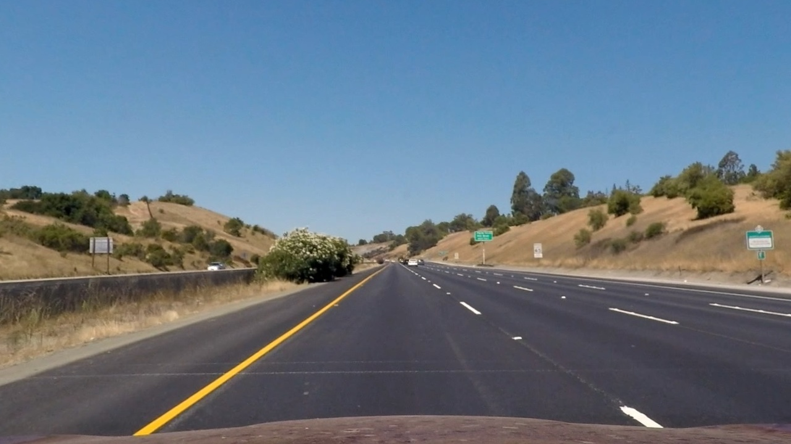
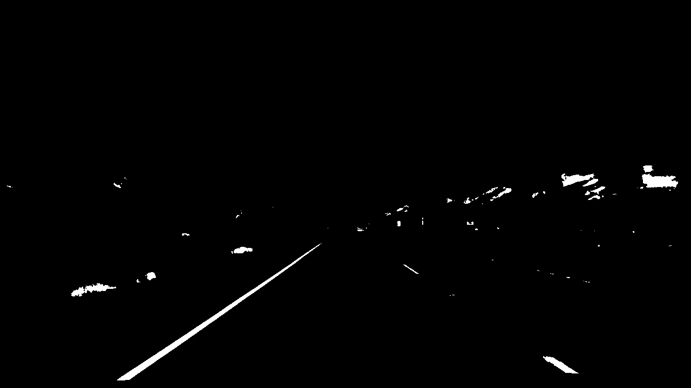
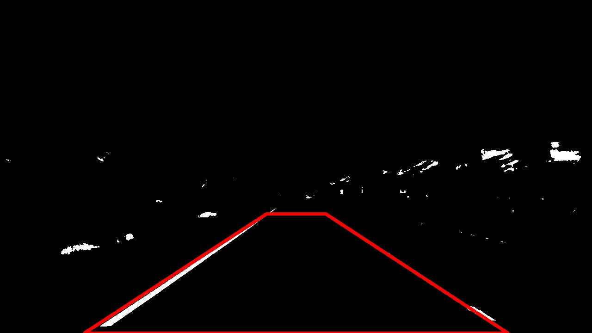
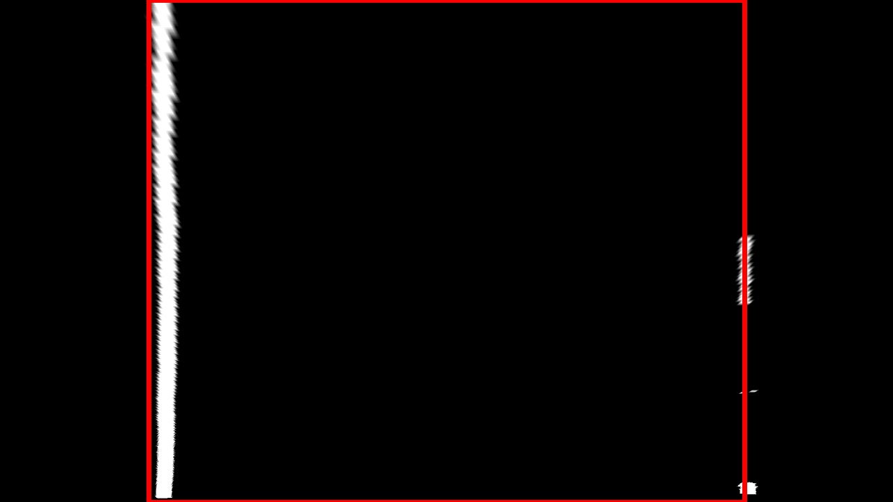
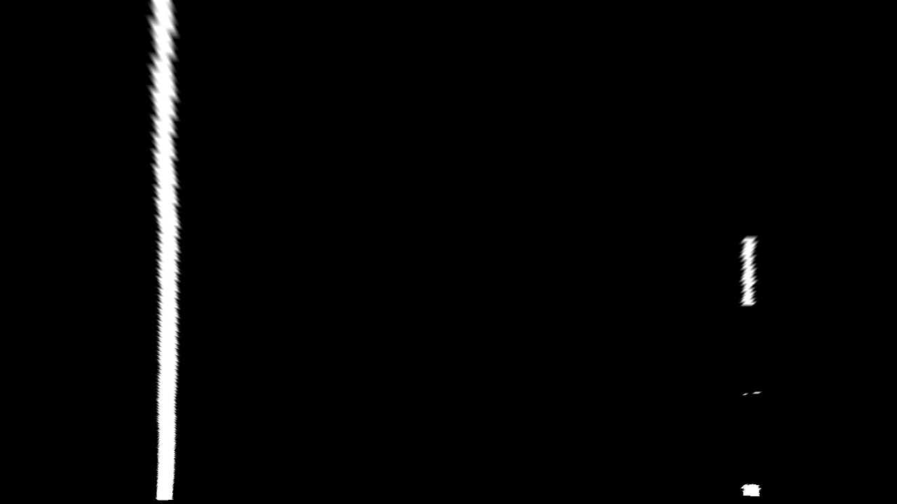

## Advanced Lane Finding

### Work in progress...

The Project
---

The goals of this project are the following:

* Compute the camera calibration matrix and distortion coefficients given a set of chessboard images.
* Apply a distortion correction to raw images.
* Use color transforms, gradients, etc., to create a thresholded binary image.
* Apply a perspective transform to rectify binary image ("birds-eye view").
* Detect lane pixels and fit to find the lane boundary.
* Determine the curvature of the lane and vehicle position with respect to center.
* Warp the detected lane boundaries back onto the original image.
* Output visual display of the lane boundaries and numerical estimation of lane curvature and vehicle position.

The pipeline
---

*This is description of how the processing is made with sample results on one inut frame.*

1. Take RAW image  

2. Undistort image (after processing sample chessboard images)

3. Binarize image using color transforms (take Red value from RGB channels and combine it with Saturation channel of HLS color space)

4. Apply trapezoidal Region of Interest (ROI) shape of expected straigt lane

5. Perspective transform of ROI to bird-eye view.

6. Use binary image withour ROI highlight for further processing

(more to come...)
