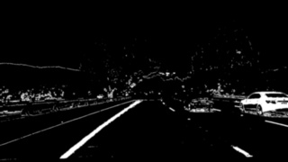
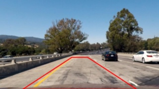
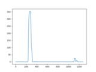
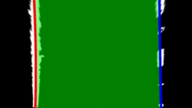
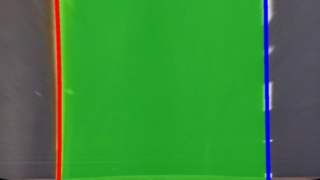

## Advanced Lane Finding

The goals of this project are the following:

* Compute the camera calibration matrix and distortion coefficients given a set of chessboard images.
* Apply a distortion correction to raw images.
* Use color transforms, gradients, etc., to create a thresholded binary image.
* Apply a perspective transform to rectify binary image ("birds-eye view").
* Detect lane pixels and fit to find the lane boundary.
* Determine the curvature of the lane and vehicle position with respect to center.
* Warp the detected lane boundaries back onto the original image.
* Output visual display of the lane boundaries and numerical estimation of lane curvature and vehicle position.

The pipeline
---

*This is description of how the processing is made with sample results on two sample input frames.*

1. Take RAW image  

2. Undistort image (after processing sample chessboard images on given camera)  
  

3. Binarize image using color transforms & magnitude of sobels (image was grayscaled to sum of half RED channel of RGB color space and half SATURIATION channel of HLS color space. Then gradient magniture of x&y solbels was taken and finally binary added to RED & SATURATION channels multiplication)  
  

4. Apply trapezoidal Region of Interest (ROI) shape of expected straigt lane  
  

5. Perspective transform of ROI to bird-eye view.  
  

6. Use binary image without ROI highlight for further processing  
  

7. Starting from bottom search for centers of mass inside rectangular areas (while shifting window to new center)  
  

Bottom start place is calculated basing on historam of bottom part of binary lanes image in axis of x like so:  

8. Basing on centers of lanes inside areas find quadratic function that matches the points and plot the lanes  

*For video processing: The quadratic function parameters are first averaged on 3 recent frames to get more stable result and overcome minor artefacts on binary image that may appear*
  
 

9. Perform lane drawing on bird-eye view of the original image  
 

10. Invert perspective transform and merge result with undistorted part of images that were out-of bounds of bird-eye view  
 

11. The radius of lanes has been calculated by applying [radius of curvature](https://www.intmath.com/applications-differentiation/8-radius-curvature.php) method. Since the video is recorded in known location and it is a turn of radius approx 1km a linear correlation between pixel radius and meters were calculated using average of values when the car is turning. 

12. Basing on left and right lane curves the pixel range of lane is calculated. Knowing the width of lane in real world pixel-to-meters ratio is calculated. Then after calculating the center between lanes off-center vlue is calculated. All calculated values are shown on last frame.  

---

### Output video: 
 
[Download video file](/examples/sample.mp4)

---

### Other test images with respective results
[Go to folder](/examples)

---

